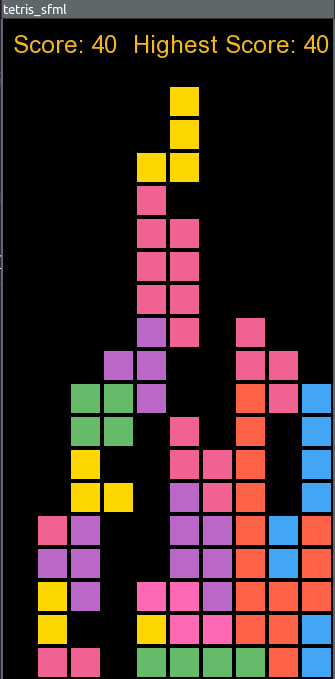

# Tetris Game

This is a Tetris game implemented in C++ using the SFML library.



## Dependencies

- SFML library 

## Installation

1. Make sure you have SFML installed on your system.
2. Clone this repository:

    ```bash
    git clone https://github.com/GargJai/tetromino-game.git
    ```

3. Compile the project using the provided Makefile:

    ```bash
    cd tetris_sfml 
    make
    ```

4. Run the executable:

    ```bash
    ./main
    ```